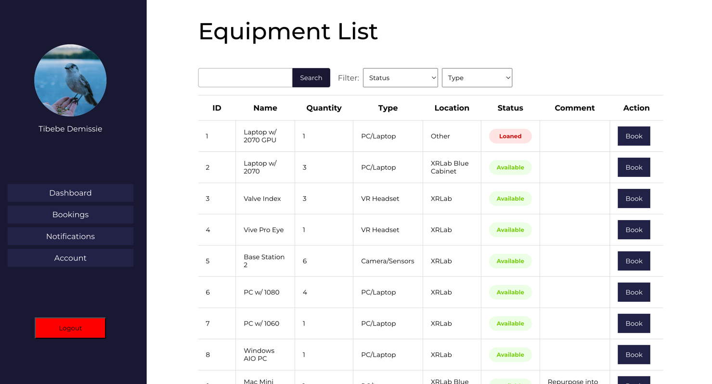

# Ergon

Ergon is a basic equipment management tool designed for university environments. It simplifies the process of borrowing and returning equipment while offering tools for managing inventory.

## Features

### For Students
- View all available equipment in a tabular format.
- Borrow equipment with real-time notifications.
- Return equipment easily with a tracking system.

### For Admins
- Add, delete, and modify equipment details.
- Generate detailed reports on equipment usage and inventory.
- Manage notifications for borrowing and returning processes.


---
## Getting Started

### Prerequisites
Ensure the following are installed on your local machine:
- Java 17 or later
- Node.js and npm/yarn
- Maven
- PostgreSQL

### Clone the Repository
```bash
git clone https://github.com/your-username/ergon.git
cd ergon
```
Build and run the backend
```bash
mvn clean install
(cd ./src/main/client && npm i)
mvn spring-boot:run
```
At this point, you should be able to access the app at [localhost:8081](localhost:8081).

_Note: By default, building the spring boot application, builds and hosts the front end alongside it. If you just want to work on the frontend, you can comment out the [following lines](https://github.com/tib-source/Ergon/blob/252ac784fafd1d4b5d170d7929db9f14e0bbab5e/pom.xml#L102-L137) and run_
```bash
cd ./src/main/client
npm i
npm run dev
```
